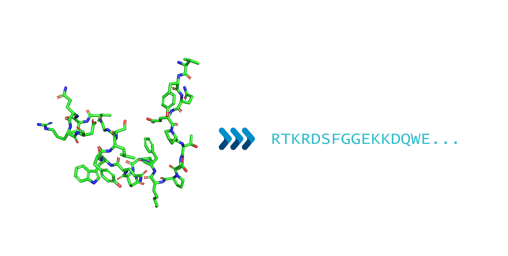

# PepToCodes (1.0.0) - Peptides to Codes

Script developed to transform the amino acid smiles to one letter code or three letter code for latter analysis.



*Illustrative image*

## Requirements

* [pandas](https://pandas.pydata.org/) - a Python package that provides fast, flexible, and expressive data structures designed to make working with "relational" or "labeled" data both easy and intuitive. 

Libraries were used in a [Miniconda3](https://docs.conda.io/en/latest/miniconda.html) environment using python 3.6.13

## Instalation

Miniconda3: [Installation](https://conda.io/projects/conda/en/latest/user-guide/install/index.html)

pandas:
```
conda install -c anaconda pandas
```

## How to use

* Download the code and unzip it on the desirable directory

* To obtain the one letter code use True as first argument and to obtain the three letter code use True as second argument

    * To obtain one letter code:
    
    ```
    python main.py True False
    ```

    * To obtain three letter code:
    
    ```
    python main.py False True
    ```

* For one aminoacid analysis:

    * Type your peptide smiles as an input

    i.e. N[C@@]([H])(CCCNC(=N)N)C(=O)N[C@@]([H])([C@]([H])(O)C)C(=O)N[C@@]([H])(CCCCN)C(=O)N[C@@]([H])(CCCNC(=N)N)C(=O)O

    * The answer will pop-up at your terminal screen

    i.e. RTKR

* For more than one aminoacid analysis:

    * Use the file [smiles.txt](resources/smiles.txt) as example on how to format input data

* Asteriscs in your code answer means the software could not recognize the input. Please, keep in mind that this software only recognizes [20 aminoacids](resources/codes.csv) for now. We are working on implementing a bigger database.

## Authorship

* Author: **Brenda Ferrari** ([brendaferrari](https://github.com/brendaferrari))

Social preview original photo by **Brenda Ferrari** ([brendaferrari](https://github.com/brendaferrari))